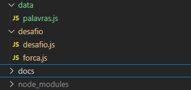

## Estrutura de diretórios



### O arquivo fonte `desafio/desafio.js`

Esse arquivo contém uma lógica simples que simula o jogo no terminal. Dessa forma, você pode interagir com as regras do jogo.
Você pode rodar o jogo através do comando na raiz do projeto:
```bash
npm start .\desafio\desafio.js
```
> Obs: para rodar o comando você precisa estar na raiz do diretório.

## Regras do jogo

As regras que devem ser implementadas são:

1. O jogo deve iniciar com 6 vidas
2. Você deve digitar uma letra, que será avaliada pelo sistema e validada se pertence a palavra secreta
3. Todo chute deve conter apenas uma letra, caso tenha mais de uma a jogada vai ser ignorada.
4. Caso a letra chutada esteja errada mas já foi chutada anteriormente a jogada vai ser ignorada.
5. Aceita apenas letras.
6. Se a letra chutada não estiver contida na palavra secreta, irá subtrair uma vida
7. Caso a quantidade de vidas chegue a 0 (zero), você perde.
8. Caso a quantidade de vidas seja maior que zero e o jogador acerte a última palavra, você ganha o jogo.